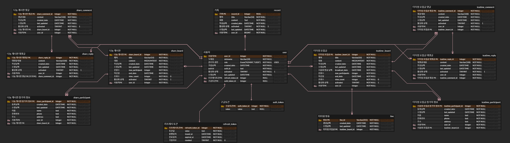
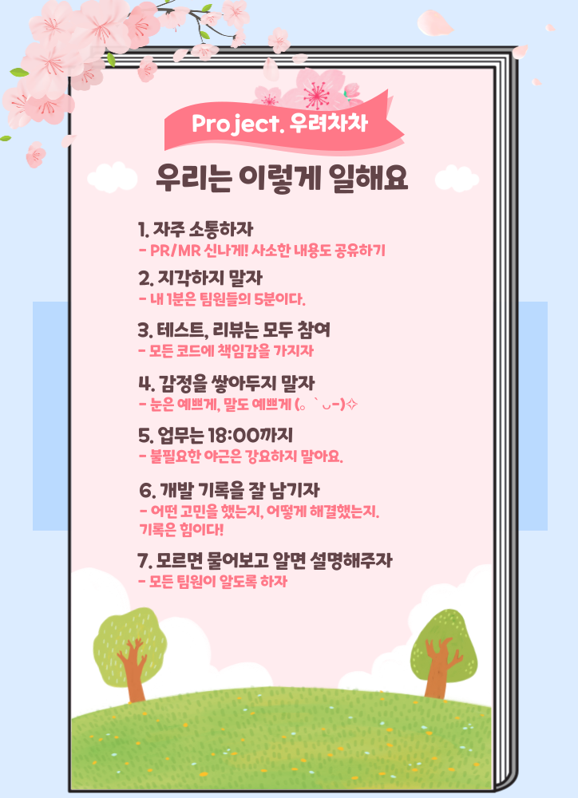

#  Moducha (모두차, 모두를 위한 차)
> 마자용 (구미 2반 2조 D202)
>
> 모두를 위한 차
>
> 프로젝트 기간 : 2024.08.01 - 2024.08.16 (7주)

  <a href="https://www.notion.so/tired-i/d5b073258ae04f59b37eab90347c40b5/">노션</a>
  &nbsp; | &nbsp; 
  <a href="https://ssafy.atlassian.net/jira/software/c/projects/S11P11D202/boards/6756/backlog3">백로그</a>
  &nbsp; | &nbsp;
  <a href="https://www.figma.com/design/kZUTKdWf5ARZF35fuIjVdW/%EB%A7%88%EC%9E%90%EC%9A%A9-%ED%94%BC%EA%B7%B8%EB%A7%88?node-id=0-1&t=z6e2psECzDWzvf0l-0">피그마</a>
  &nbsp; | &nbsp; 
  <a href="https://miro.com/app/board/uXjVK2ZTE6M=/">미로</a>
  &nbsp; | &nbsp;
  <a href="https://hub.docker.com/u/ramen4598"> dockerhub</a>

## 카테고리

| Application                       | Domain                                | Language                         | Framework                            |
| --------------------------------- | ------------------------------------- | -------------------------------- | ------------------------------------ |
| :white_check_mark: Desktop Web    | :black_square_button: AI                 | :black_square_button: JavaScript | :black_square_button: Vue.js         |
| :white_check_mark: Mobile Web     | :black_square_button: Big Data        | :white_check_mark: TypeScript    | :white_check_mark: React             |
| :white_check_mark: Responsive Web | :black_square_button: Blockchain      | :black_square_button: C/C++      | :black_square_button: Angular        |
| :black_square_button: Android App | :black_square_button: IoT             | :black_square_button: C#         | :white_check_mark: NginX             |
| :black_square_button: iOS App     | :black_square_button: AR/VR/Metaverse | :black_square_button: Python     | :black_square_button: Flask/Django   |
| :black_square_button: Desktop App | :black_square_button: Game            | :white_check_mark: Java          | :white_check_mark: Spring/Springboot |
|                                   |                                       | :black_square_button: Kotlin     |                                      |

 
 

## 👇 모두차 소개 및 시연 영상 👇

모두차 시나리오는 👉[여기](./docs/시연%20시나리오.md)👈에서 더 자세히 보실 수 있습니다.

 
 

## 🍵 모두차 상세 설명

### 📌 <ins>기획 배경

> **티타임 방송**을 통해 차 문화를 즐기고, 차를 소분하며 서로 나누는 문화를 함께하는 플랫폼

 

**❓ 왜 티타임을 온라인으로 하나요?**

차는 단순히 우리고 마시는 것만이 전부가 아닙니다.  차를 우리고 시음하고 즐기는 과정 그 자체를 **함께하고 싶은 사람들**이 많습니다.  우리는 차를 즐기는 사람, 차를 즐기고 싶은 사람 모두 같이 즐거움을 느낄 수 있는 **공간을 제공**합니다.

 

### 💡 <ins>모두차 목적

**차 문화에 입문하고자 하는 사람들이 쉽게 진입할 수 있도록** 하며, 차를 즐기던 애호가들도 **나눔의 즐거움을 더 키울 수 있게 도울 수 있는 커뮤니티**를 형성하여 **차 문화를 더 많은 사람들이 향유** 할 수 있는 환경을 조성하고자 한다.

- 애호가 : 차를 나눔하고, 함께 차를 마시며 정보를 공유한다.
- 🌱입문자 : 차의 종류와 맛, 취향, 차 우리는 법 등 정보를 얻는다.

### <U>🍀 차를 좋아하는 사람들을 연결하고 즐거움과 편의 제공</U>

 

**🙋🏻‍♂️ 사용자 목표**

> 차를 좋아하는 사람들이 온라인으로 시음회를 즐기고, 부가적으로 정보를 얻을 수 있는 화상모임/커뮤니티 플랫폼

 

차와 관련된 여러 편의 기능을 제공하여 즐거움/편의 제공

- 애호가는 입문자에게 차를 나누어주고, 일정에 맞춰 다도회를 연다.
- 다도회에서 애호가는 차와 다예에 대해 설명하고, 이것으로 입문자는 차의 종류와 맛, 차를 우리는 법 등에 대해 알 수 있게 된다.

 
 

## 🖥️ 모두차 서비스 화면
### 메인

### 나눔 - 목록, 검색 및 정렬

### 나눔 - 글 쓰기, 조회, 수정

### 나눔 - 댓글/대댓글

### 나눔 - 참가

### 티타임 - 목록, 검색 및 정렬

### 티타임 - 글 쓰기, 조회, 수정

### 티타임 - 댓글/대댓글

### 티타임 - 참가

### 티타임 - 방송, 화면 공유, 카메라 및 소리 on/off, 강퇴, 채팅

### 티타임 - 채팅

### 마이페이지 - 티타임,나눔 게시글 조회

### 마이페이지 - 닉네임 수정, 탈퇴

 
 

## 🔎 주요 기능
- 로그인/로그아웃
  - OAuth2를 이용한 구글 소셜 로그인 지원
- webRTC를 통한 티타임 방송
  - 비디오 및 소리 on/off, 강퇴, 화면 공유, 채팅
- 차 나눔/티타임 게시판
- 게시글 목록 검색 및 정렬

 

### <ins>차별점

#### 기술 관점

- CI/CD 파이프라인 구축 및 배포 자동화
- WebRTC & WebSocket 기반의 실시간 스트리밍 및 채팅 기능 제공
- Nginx Reverse Proxy 사용
- Nginx SSL Termination을 통한 백엔드 서버 부하 감소
- FE, BE, MediaServer, DB를 각 docker 컨테이너로 관리하여 빌드 및 배포. 안정적인 CI / CD 구축
- Google OAuth2 + Spring Security + JWT 를 통한 로그인 로직 구현으로 안정적이며 stateless한 인증/인가 구현
- ~~생성형 AI를 사용한 맞춤형 차 추천 기능 제공~~

 

#### 기능 관점

- 차 문화를 활성화 할 수 있는 다양한 기능 제공.
   - 원격 회의 서비스를 이용한 실시간 원격 시음회 지원
   - 원활한 시음회 진행을 위한 강력한 보조기능 제공
     - 화면 공유
     - 음소거 및 해제
     - 화면 끄기 및 켜기
     - 강제퇴장
   - ~~방송 화면에서 작성자가 차 관련 정보 제공 기능~~

- 차를 나눔할 수 있는 커뮤니티 제공
   - 게시글 쓰기 및 댓글/대댓글을 통해 소통 가능
   - 작성자에게 배송정보 리스트 제공

- 마이페이지
   - 자신이 작성한 글, 참여한 글 목록 제공

 
 

## 🔨 개발 환경

🛠️**Backend**
- IntelliJ
- spring boot
- spring-boot-jpa
- Spring Security
- OAuth2
- Java 17
- MySQL
- Redis
- Gradle

🛠️**Frontend**
- Visual Studio Code
- React
- daysiUI
- Zustand
- TypeScript

🛠️**Web RTC**
- OpenVidu 3.0.0-beta2

🛠️**CI/CD**
- aws ec2
- docker
- nginx
- jenkins

 
 

## 📋 모두차 관련 문서
### <ins>기능 정의서

[기능 정의서](./docs/기능정의서.md)

 

### <ins>와이어프레임

[와이어프레임](https://www.figma.com/design/yAiuzxtFcEmW74QVPnrLpC/%EB%A7%88%EC%9E%90%EC%9A%A9_%EC%9C%A0%EB%A3%8C?node-id=88-6950&t=KvEZ74r3O2vZagS6-1)

 

### <ins>서비스 아키텍처

 

### <ins>ERDiagram

 

### <ins>API 명세서

[API 명세서]([./docs/ERD.png](https://tired-i.notion.site/API-1ed3e038a21040c28d5e6d658a20edb2?pvs=4))

 

### <ins>그라운드 룰

 
 

<!-- ## 팀 소개
* 김봉상: 팀장, 프론트엔드 개발
* 권대호: 부팀장, 기획 및 와이어프레임 작성, 프론트엔드 개발
* 최진오 : 프론트엔드 개발
* 김범중: 백엔드 개발 및 QA 담당
* 김소연: 백엔드 개발, Swagger API 문서 관리
* 김의근: 코드 리뷰 및 인프라 담당, CI/CD, HTTPS, Docker 구성 -->

## 멤버 소개

<table align="center">
    <thead>
        <tr>
            <th>김봉상 (FE)</th>
            <th>권대호 (FE)</th>
            <th>최진오 (FE)</th>
        </tr>
    </thead>
    <tbody align="center">
        <tr>
            <td width="150">
                
            </td>
            <td width="150">
                
            </td>
            <td width="150">
                
            </td>
        </tr>
        <tr>
            <td><a href="https://github.com/BongSangKim">@BongSangKim</a></td>
            <td><a href="https://github.com/vaaast-lake">@vaaast-lake</a></td>
            <td><a href="https://github.com/sidamodev">@sidamodev</a></td>
        </tr>
        <tr>
            <td>팀장   프론트엔드 팀장</td>
            <td>팀원</td>
            <td>팀원</td>
        </tr>
    </tbody>
</table>

 

<table align="center">
    <thead>
        <tr>
            <th>김의근 (BE)</th>
            <th>김범중 (BE)</th>
            <th>김소연 (BE)</th>
        </tr>
    </thead>
    <tbody align="center">
        <tr>
            <td width="150">
                
            </td>
            <td width="150">
                
            </td>
            <td width="150">
                
            </td>
        </tr>
        <tr>
            <td><a href="https://github.com/ramen4598">@ramen4598</a></td>
            <td><a href="https://github.com/bbamjoong">@bbamjoong</a></td>
            <td><a href="https://github.com/so-oyeon">@so-oyeon</a></td>
        </tr>
        <tr>
            <td>백엔드 팀장</td>
            <td>팀원</td>
            <td>팀원</td>
        </tr>
    </tbody>
</table>