## 목차
- [버전 정보](#버전-정보)
- [환경변수](#환경변수)
  - [frontend .env](#frontend-env)
  - [backend .env](#backend-env)
- [배포 시 주의사항](#배포-시-주의사항)
- [시나리오](#시나리오)
    - [메인](#메인)
    - [로그인](#로그인)
    - [나눔 - 목록, 검색 및 정렬](#나눔---목록-검색-및-정렬)
    - [나눔 - 글 쓰기, 조회, 수정](#나눔---글-쓰기-조회-수정)
    - [나눔 - 댓글/대댓글](#나눔---댓글대댓글)
    - [나눔 - 참가](#나눔---참가)
    - [나눔 - 참가자 목록 조회](#나눔---참가자-목록-조회)
    - [티타임 - 목록, 검색 및 정렬](#티타임---목록-검색-및-정렬)
    - [티타임 - 글 쓰기, 조회, 수정](#티타임---글-쓰기-조회-수정)
    - [티타임 - 댓글/대댓글](#티타임---댓글대댓글)
    - [티타임 - 참가](#티타임---참가)
    - [티타임 - 방송, 카메라 및 소리 on/off, 강퇴, 채팅](#티타임---방송-카메라-및-소리-onoff-강퇴-채팅)
    - [티타임 - 채팅](#티타임---채팅)
    - [마이페이지 - 티타임,나눔 게시글 조회](#마이페이지---티타임나눔-게시글-조회)
    - [마이페이지 - 닉네임 수정](#마이페이지---닉네임-수정)
    - [마이페이지 - 탈퇴](#마이페이지---탈퇴)

<br>

# 버전 정보

- Intellij 2024.1.4
- Vscode 1.90.2
- Node 20.15.0
- npm 10.8.1
- MySQL 8.4.1
- SpringBoot 3.3.0
- JPA 3.3.0
- Nginx 1.26.1
- OpenVidu v3.0.0-beta2
- Ubuntu 22.04 LTS
- docker 27.1.1


---
# 환경변수

## frontend .env
  ```json
  {/* .env-cmdrc.json */}
  {
    "prod": {
      "VITE_API_URL": "https://moducha.site/api/v1",
      "VITE_TEST_APP_SERVER_URL": "https://moducha.site/api/v1",
      "VITE_APP_SERVER_URL": "",
      "VITE_LIVETKIT_URL": "https://livekit.moducha.site"
    }
  }
  
  {/* .env */ }
  VITE_DOCK_APP_SERVER_URL=Docker 환경 시 접근해야 할 BE 서버
  VITE_DOCK_LIVEKIT_URL=Docker 환경 시 접근해야 할 media server

  VITE_DP_APP_SERVER_URL=배포 환경 시 접근해야 할 BE 서버
  VITE_DP_LIVETKIT_URL=배포 환경 시 접근해야 할 media server
  ```

  

## backend .env
```
MYSQL_HOST = 데이터베이스 서버의 호스트 주소
MYSQL_PORT = MySQL 서버가 사용하는 포트번호. Default :3306
MYSQL_DB = 연결할 MySQL 데이터베이스의 이름
MYSQL_USER = MySQL 데이터베이스에 접속할 사용자 이름
MYSQL_PASSWORD = 해당 사용자의 비밀번호

JWT_SECRET_KEY = JSON Web Token(JWT)을 생성하고 검증할 때 사용하는 비밀 키. 토큰의 서명을 생성, 검증하는데 이용
DDL_AUTO_OPTION = Hibernate의 데이터베이스 스키마 생성 옵션을 설정

GOOGLE_CLIENT_NAME = OAuth 클라이언트의 이름
GOOGLE_CLIENT_ID = Google OAuth 2.0 클라이언트 ID로, Google Cloud 콘솔에서 생성된 ID
GOOGLE_CLIENT_SECRET = Google OAuth 2.0 클라이언트 비밀 키
GOOGLE_REDIRECT_URI = Google OAuth 인증이 완료된 후 리디렉션될 URI (사용자가 로그인 후 리디렉션될 URI)
GOOGLE_AUTHORIZATION_GRANT_TYPE = OAuth 2.0에서 사용되는 인증 유형입
GOOGLE_SCOPE = Google OAuth에서 요청할 권한 범위

LIVEKIT_API_KEY = LiveKit API를 사용할 때 필요한 API 키
LIVEKIT_API_SECRET = LiveKit API 키와 함께 사용되는 비밀 키
HOST_URL = LiveKit 서버의 호스트 URL

REDIRECT_URI = http:OAuth 인증 이후 사용자 인터페이스로 리디렉션할 URI
CORS_URL = CORS(Cross-Origin Resource Sharing)를 허용할 도메인

MULTIPART_ENABLED = 멀티파트 파일 업로드를 활성화할지 여부를 설정
MAX_FILE_SIZE = 업로드할 수 있는 최대 파일 크기
MAX_REQUEST_SIZE = 하나의 요청에서 처리할 수 있는 파일의 최대 크기
PROFILES_INCLUDE = 포함할 Spring 프로파일을 지정. 우리 프로젝트는 private로 설정

AWS_CREDENTIALS_ACCESSKEY = AWS S3에 접근할 때 사용하는 접근 키
AWS_CRETENDIALS_SECRETKEY = 접근 키와 함께 사용되는 비밀 키
AWS_S3_BUCKETNAME = 사용할 S3 버킷의 이름
AWS_REGION_STATIC = S3 버킷이 위치한 AWS 리전. 우리 프로젝트는 ap-northeast-2(서울) 사용
```

---
# 배포 시 주의사항
- certbot을 통해서 HTTPS 인증서를 발급받아야 합니다.
- openvidu 설정 파일을 수정해야 합니다.
  - caddy.yaml에 http, https 포트번호를 설정해야 합니다.
    ```
    apps:
    # ... 중략 ... #
        http:
            http_port: 8445
            https_port: 8443
    ```
  - livekit.yaml에 webhook 받는 주소를 수정해야 합니다.
    ```
    webhook:
    # ... 중략 ... #
        urls:
            - https://moducha.site/api/v1/livekit/webhook
    ```
  - mute 해제를 위해 livekit.yaml에 설정 추가
    ```
    room:
        enable_remote_unmute: true
    ```

---
# 시나리오
### 메인
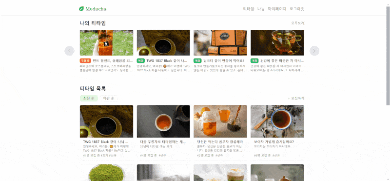

### 로그인
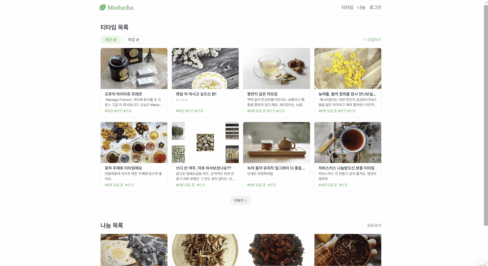

### 나눔 - 목록, 검색 및 정렬
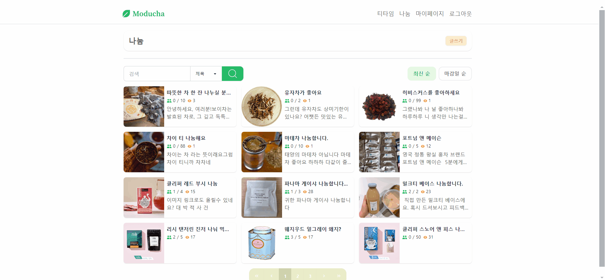

### 나눔 - 글 쓰기, 조회, 수정
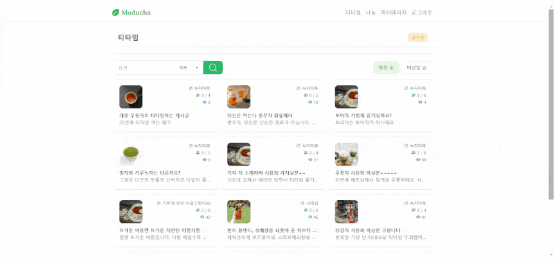

### 나눔 - 댓글/대댓글
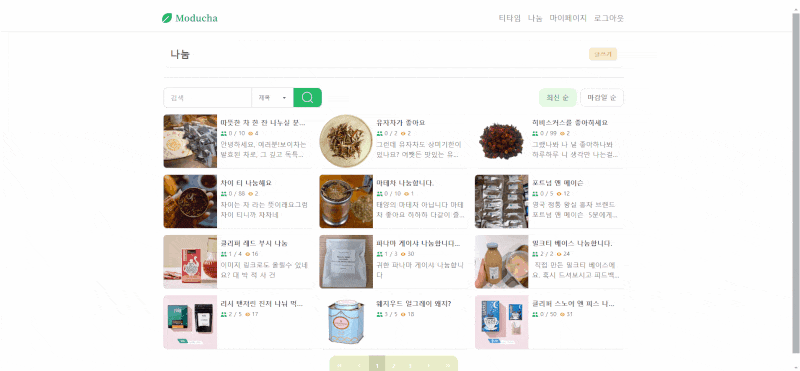

### 나눔 - 참가
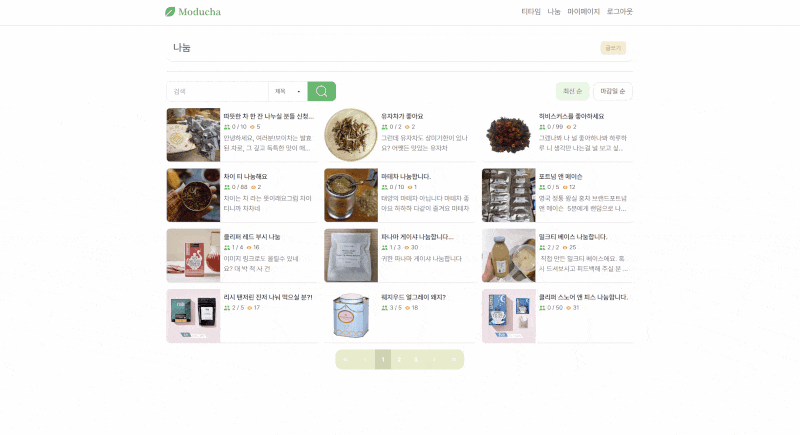

### 나눔 - 참가자 목록 조회


### 티타임 - 목록, 검색 및 정렬
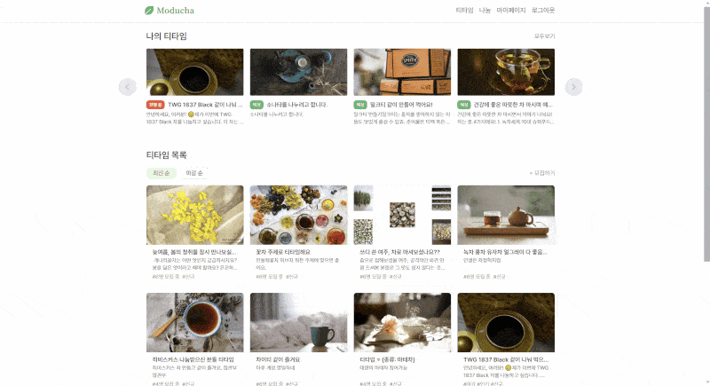

### 티타임 - 글 쓰기, 조회, 수정


### 티타임 - 댓글/대댓글
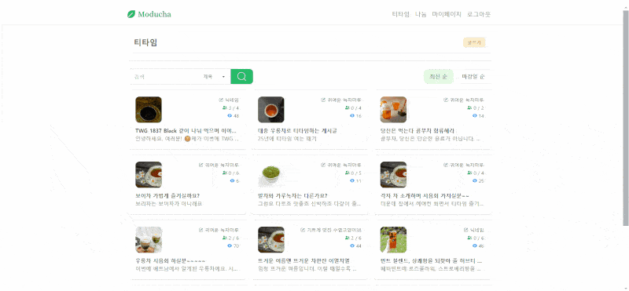

### 티타임 - 참가
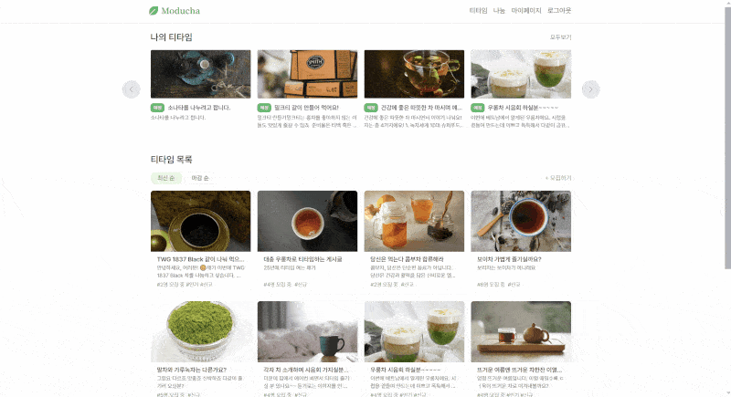

### 티타임 - 방송, 카메라 및 소리 on/off, 강퇴, 채팅

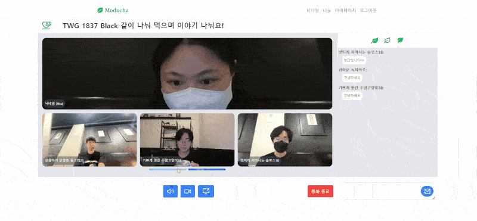

### 티타임 - 채팅
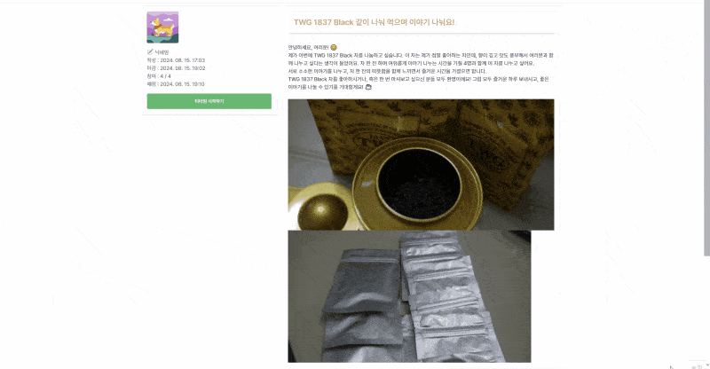

### 마이페이지 - 티타임,나눔 게시글 조회


### 마이페이지 - 닉네임 수정


### 마이페이지 - 탈퇴


---